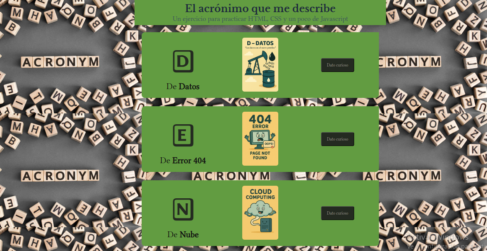
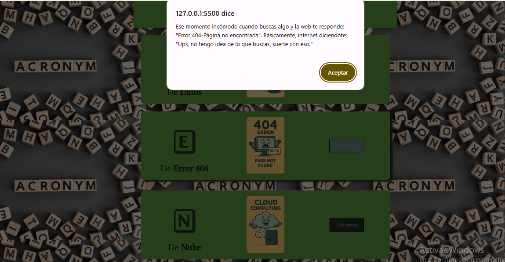

# Acrónimo: DEN



## 🟢✨ Descripción
Este proyecto es un **ejercicio práctico de HTML, CSS y JavaScript** en el que se presenta un acrónimo que describe ciertos conceptos relacionados con la tecnología y la informática.  

Cada letra del acrónimo (`D`, `E`, `N`) tiene asociada una tarjeta interactiva con una imagen y un botón que despliega un dato curioso al usuario.

---

## ⭐✨🛠️ Características principales
- Diseño **responsivo** adaptable a distintos tamaños de pantalla.
- Uso de **tipografías personalizadas** a través de Google Fonts.
- Interactividad mediante **JavaScript** para mostrar mensajes informativos.
- Estética moderna con **hover effects** en las tarjetas.

---

## 🗂️📁 Estructura del proyecto

### HTML
- `index.html`: estructura principal con secciones de tarjetas.
- Secciones `<section class="card">` para cada letra del acrónimo.

### CSS
- `acronimo.css`: estilos para tarjetas, botones, tipografías y fondo.
- Uso de variables CSS para mantener colores y fuentes consistentes.
- Efectos de transición al pasar el cursor (`hover`) sobre las tarjetas.

### JavaScript
- `acronimo.js`: scripts para manejar los **clicks en los botones** y mostrar alertas con datos curiosos.

---

## ▶️💻 Uso del proyecto

1. Clonar el repositorio:
   ```bash
   git clone https://github.com/usuario/proyecto-acronimo-den.git

2. Abrir el archivo acronimo.html en cualquier navegador moderno.

3. Hacer clic en los botones de cada tarjeta (D, E, N) para desplegar los datos curiosos.

---

## 🖼️📸 Capturas de pantalla
**Página principal**


**Interacción con botones**


## 🖥️⚙️ Tecnologías utilizadas
🏗️ HTML5: estructura del contenido.

🎨 CSS3: diseño visual, tipografía y efectos.

🔄💻 JavaScript: interactividad.

Google Fonts: tipografías Libertinus Keyboard, Libertinus Serif Display y Libre Baskerville.


## 📜⚖️ Licencia
Este proyecto está bajo la licencia MIT. Puedes usarlo y modificarlo libremente para fines educativos o personales.


---

## 🙌 Author

Creado con ❤️ por Denisse González.  
